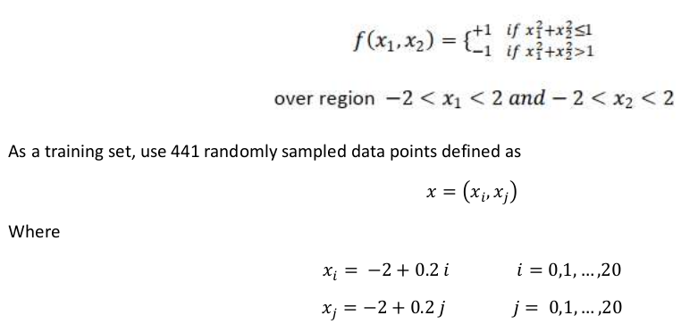

# *Building a Radial basis function network (RBFN) from scratch
*

## Overview

-   Designed a Radial basis function Neural Network based on Gaussian kernel functions
-   Centers of the Radial basis functions is chosen in three ways:
    - using all the points in the training set
    - Randomly selecting the centers from the input data
    - Using K-Means algorithm to find the centers
-  Dataset is generated in following way

